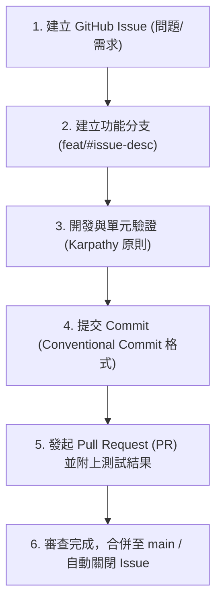

# AGENTS.md - 專案 AI 全域協作規範 (Global AI Agent Architecture)

> **本檔案為專案的核心 AI 規範與協作指南。**  
> 不論使用的是 **Claude (Claude Code / Cursor)**、**Gemini (Antigravity)** 或 **ChatGPT / Copilot**，所有 AI Agent 與開發者皆必須嚴格遵守本文件所述之開發流程、Git 規範與交接協議。

---

## 1. 專案簡介與環境指令 (Environment & Stack)

- **專案名稱**：易經數字占卜 (VibeCodingDivinationByNumbers)
- **技術棧**：Python 3.11+, Flask 2.3.3, HTML5 / CSS3 / Vanilla JavaScript
- **主要檔案**：
  - `app.py`: Flask 後端 API 及易經六十四卦資料庫
  - `templates/index.html`: 前端 UI 畫面
  - `static/style.css` & `static/script.js`: 前端樣式與 AJAX 邏輯
  - `運行說明.md` & `README.md`: 說明文件

### 常用命令選單
```powershell
# 1. 建立並啟動虛擬環境 (Windows PowerShell)
pyenv local 3.11.9
python -m venv .venv
.\.venv\Scripts\python.exe -m pip install -r requirements.txt

# 2. 啟動應用 (自動尋找空閒 Port，預設優先使用 5001)
.\.venv\Scripts\python.exe app.py

# 3. 指定 Port 啟動
$env:PORT=5001; .\.venv\Scripts\python.exe app.py
```

---

## 2. GitHub Issue-Driven & PR 開發流程

所有功能開發、Bug 修復或代碼重構，必須依循以下 GitHub 流程：



### 分支命名規範 (Branch Naming)
- 新功能：`feat/#<issue_id>-<brief-description>` （例如：`feat/#12-add-history-export`）
- 錯誤修復：`fix/#<issue_id>-<brief-description>` （例如：`fix/#15-port-conflict`）
- 文件/重構：`docs/#<issue_id>-<desc>` 或 `refactor/#<issue_id>-<desc>`

### Git Commit 訊息規範 (Conventional Commits)
- **格式**：`<type>(<scope>): <subject>`
- **語言**：**必須使用正體中文 (繁體中文)**。
- **範例**：
  - `feat(divination): 新增六十四卦歷史占卜紀錄導出功能`
  - `fix(server): 修復 Port 佔用時連線被拒的問題`
  - `docs(readme): 更新動態 Port 說明文件`

### Pull Request (PR) 規範
1. 標題必須包含 Issue 編號與變更簡述。
2. 內文必須包含：
   - 變更摘要 (Summary)
   - 驗證方式與測試命令輸出結果
   - `Closes #<issue_id>`（自動連結並關閉對應 Issue）

---

## 3. AI 開發四大原則 (Karpathy Principles)

1. **謀定而後動 (Think Before Coding)**：動工前先明確陳述假設與影響範圍；若任務具模糊性，須列出方案與使用者確認。
2. **簡潔至上 (KISS Principle)**：僅撰寫解決當前 Issue 所需的最少代碼，拒絕過度工程。
3. **微創異動 (Surgical Changes)**：精準修改與任務直接相關的檔案；嚴禁主動重構無關程式碼或調整鄰近格式。
4. **目標導向驗證 (Goal-Driven Execution)**：修改檔案後，必須執行啟動或測試命令，驗證功能無誤才算完成任務。

---

## 4. 跨 AI 任務交接協議 (AI Handoff Protocol)

當任務尚未完成，或需要移交給其他 AI / 開發者接手時，請按以下步驟操作：

1. **紀錄任務快照**：在專案根目錄建立或更新 `.agent_task_state.md`（上限 50 行），內容包含：
   - 🚩 **當前目標**：正在處理的 Issue 或功能。
   - ✅ **已完成進展**：已修改的檔案與步驟。
   - 🚀 **下一步行動**：接手的 AI 應執行的下一個具體動作。
   - ⚠️ **已知風險/待測試**：未解決的細節或需要特別注意的環境變數。
2. **更新 CHANGELOG**：重要異動記錄於 `CHANGELOG.md`。

---

> [!IMPORTANT]
> **全域約束**：無論使用何種 AI 工具，回覆說明、Commit 訊息、文件更新皆必須使用 **正體中文 (繁體中文)**。
